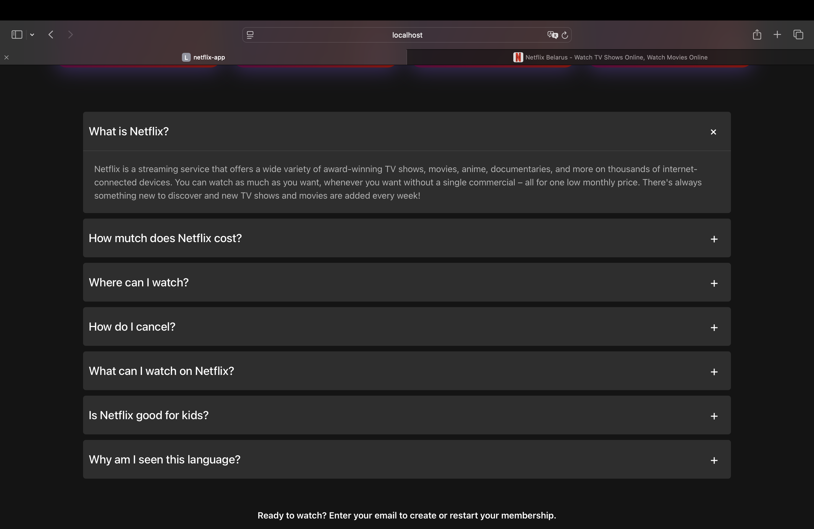

# Netflix Clone

Полнофункциональная копия Netflix с современным дизайном, навигацией и мультиязычной поддержкой, созданная на React.

## 🆕 Последние обновления

- ✅ **Страница регистрации** - полноценная форма Sign Up с валидацией
- ✅ **Улучшенная навигация** - передача email с главной на регистрацию через URL
- ✅ **Чистая архитектура** - создана папка `pages` для разделения страниц и компонентов
- ✅ **Компонент AuthForm** - переиспользуемая форма для логина и регистрации (без дублирования кода)
- ✅ **Оптимизация App.jsx** - упрощен с 90 до 15 строк (только роутинг)
- ✅ **FormData API** - современный подход к работе с формами без лишних useState

## 📸 Скриншоты

### Главная страница


### Слайдер с фильмами


### Страница входа


### Страница регистрации


### FAQ секция


### Переключение языков


## 🛠 Технологии

- **React 18** - библиотека для создания пользовательских интерфейсов
- **React Router DOM** - маршрутизация и навигация
- **i18next** - библиотека для интернационализации (i18n)
- **react-i18next** - интеграция i18next с React
- **i18next-http-backend** - загрузка переводов из JSON файлов
- **i18next-browser-languagedetector** - автоматическое определение языка браузера
- **Vite** - быстрый инструмент сборки и разработки
- **CSS Modules** - модульные стили для компонентов
- **ESLint** - линтер для качества кода
- **localStorage** - хранение избранных фильмов и настроек языка

## 🎯 Что реализовано

### 🏠 Главная страница
- **Hero-секция** с полноэкранным фоновым изображением и градиентными тенями
- **Переключение языков** через select с автоматическим сохранением в localStorage
- **Форма подписки** с email-инпутом в hero-секции
- **Слайдер с фильмами** - 10 фильмов с навигацией влево/вправо
- **Карточки фильмов** с постером, рейтингом IMDb и кнопкой избранного
- **Секция "Причины присоединиться"** - 4 карточки с преимуществами Netflix
- **FAQ секция** - 7 раскрывающихся вопросов с анимацией
- **Форма подписки** внизу страницы
- **Footer** с ссылками
- **Адаптивный дизайн** для всех устройств

### 🔐 Страница входа (Login)
- **Полноценная форма авторизации** с валидацией
- **Кастомный чекбокс** "Remember me" с анимацией
- **Кнопки навигации** между страницами
- **Ссылки** "Forgot password" и "Sign up"
- **Тот же дизайн** что и на главной странице
- **Поддержка мультиязычности** на всех элементах формы

### 📝 Страница регистрации (Register)
- **Полноценная форма регистрации** с валидацией
- **Три поля**: Email, Пароль, Подтверждение пароля
- **Автозаполнение email** из URL параметров (переход с главной страницы)
- **Переход на страницу входа** через ссылку
- **Единый дизайн** с формой входа через компонент AuthForm
- **Поддержка мультиязычности** на всех элементах

### 🧭 Навигация
- **React Router** для SPA-навигации
- **Программная навигация** через useNavigate
- **Клик по логотипу** возвращает на главную страницу с любой страницы
- **Кнопка Sign In** в Header ведет на страницу входа
- **Кнопка Get Started** на главной перенаправляет на регистрацию с email в URL
- **Передача данных между страницами** через URL параметры (useSearchParams)
- **Автозаполнение формы** регистрации email'ом с главной страницы
- **URL-маршруты**: `/` (главная), `/login` (вход), `/register` (регистрация)
- **Переходы между формами**: Login ↔ Register через ссылки

### 🎬 Слайдер фильмов (MovieSlider)
- **10 фильмов** с постерами высокого качества
- **Навигация влево/вправо** с кнопками-стрелками
- **Анимация переключения** с плавным transform и transition
- **Автоматическое отключение кнопок** на крайних позициях
- **Показ 5 фильмов одновременно** на десктопе
- **MovieCard компоненты** с рейтингом IMDb и кнопкой избранного
- **State управление** (currentSlide, isAnimating) для плавной работы

### ❓ FAQ секция (FAQGroup + FAQElement)
- **7 вопросов и ответов** о Netflix
- **Раскрывающиеся элементы** с анимацией
- **Кнопка "+"** которая поворачивается при открытии
- **State для каждого элемента** - независимое открытие/закрытие
- **Переводы на все языки** через i18n
- **Темы**: что такое Netflix, цены, устройства, отмена, контент для детей и т.д.

### 🌍 Мультиязычность (i18n)
- **Поддержка языков**: Английский (EN) и Русский (RU)
- **i18next** для управления переводами
- **Автоматическое определение** языка браузера
- **Сохранение выбора языка** в localStorage
- **Динамическая загрузка** переводов из JSON файлов
- **Переводы всего контента**: заголовки, кнопки, формы, FAQ и т.д.

### ❤️ Избранное (FavoriteButton)
- **Кнопка-сердечко на каждой карточке фильма** для добавления в избранное
- **Хранение в localStorage** - каждый фильм сохраняется отдельно по ID (`favorite_${movieId}`)
- **Персистентность** - состояние сохраняется между сессиями
- **Анимированная иконка** с плавным переходом заполненного/пустого состояния
- **useEffect для загрузки** сохраненного состояния при монтировании компонента
- **Memo оптимизация** для предотвращения лишних ререндеров

## 🚀 Запуск проекта

```bash
# Установка зависимостей
npm install

# Запуск в режиме разработки
npm run dev

# Сборка для продакшена
npm run build
```

## 📁 Структура проекта

```
src/
├── pages/                   # 🆕 Страницы приложения
│   ├── HomePage/            # Главная страница
│   │   └── HomePage.jsx     # Логика и компоненты главной
│   ├── LoginPage/           # Страница входа
│   │   └── LoginPage.jsx    # Обертка Login + Footer
│   ├── RegisterPage/        # Страница регистрации
│   │   └── RegisterPage.jsx # Обертка AuthForm + Footer
│   └── index.js             # Экспорт всех страниц
├── Components/
│   ├── AuthForm/            # 🆕 Общий компонент форм
│   │   ├── AuthForm.jsx     # Форма для Login/Register
│   │   └── AuthForm.module.css
│   ├── Header/              # Навигация и hero-секция
│   │   ├── Header.jsx       # Компонент с формой подписки
│   │   └── Header.module.css
│   ├── Login/               # Логика страницы входа
│   │   ├── Login.jsx        # Обработчик данных формы
│   │   └── Login.module.css
│   ├── MembershipForm/      # Форма подписки
│   │   ├── MembershipForm.jsx # Переход на регистрацию с email
│   │   └── MembershipForm.module.css
│   ├── MovieCard/           # Карточки фильмов
│   ├── MovieSlider/         # Слайдер фильмов
│   ├── FavoriteButton/      # Кнопка избранного
│   │   ├── FavoriteButton.jsx
│   │   └── FavoriteButton.module.css
│   ├── HeartIcon/           # Иконка сердечка
│   ├── FAQElement/          # Элемент FAQ
│   ├── FAQGroup/            # Группа FAQ элементов
│   ├── ReasonsCard/         # Карточка с преимуществами
│   ├── Footer/              # Подвал сайта
│   └── ...                  # Другие компоненты
├── config/
│   └── i18n.js              # Конфигурация i18next
├── styles/
│   ├── globals.css          # Глобальные стили
│   ├── variables.css        # CSS переменные
│   └── index.css            # Основные стили
├── assets/
│   └── images/              # Изображения и логотипы
├── App.jsx                  # 🆕 Чистый роутинг (15 строк)
└── main.jsx                 # Точка входа

public/
└── locales/
    ├── en/
    │   └── translation.json # Английские переводы
    └── ru/
        └── translation.json # Русские переводы
```

## ✨ Ключевые особенности

### 🎨 Дизайн
- **Точная копия Netflix UI** с фирменными цветами
- **Полупрозрачные элементы** и градиенты
- **Кастомные компоненты** (чекбоксы, кнопки, формы, сердечки)
- **Плавные анимации** и переходы
- **Адаптивные карточки фильмов** с hover-эффектами
- **Единый дизайн** форм логина и регистрации

### 🔧 Функциональность
- **Мультиязычность** (English, Русский) с автоопределением языка
- **Система избранного** с сохранением в localStorage
- **Работающая навигация** между страницами (Home → Login → Register)
- **Умные переходы** - передача email с главной на регистрацию через URL
- **Автозаполнение форм** из URL параметров
- **Адаптивные формы** с валидацией (required, type checking)
- **Модульная архитектура** - разделение на pages и components
- **Интерактивный FAQ** с раскрывающимися секциями
- **Слайдеры контента** с каталогом фильмов

### 🧹 Чистый код
- **Отсутствие дублирования** - общий компонент AuthForm для логина/регистрации
- **Папка pages** - четкое разделение страниц и компонентов
- **App.jsx упрощен** с 90 до 15 строк - только роутинг
- **Переиспользуемые компоненты** - DRY принцип
- **FormData API** - современный подход к работе с формами
- **useRef вместо useState** где это возможно для оптимизации

### 💾 Хранилище данных (localStorage)
- **Избранные фильмы** - `favorite_${movieId}` для каждого фильма (boolean)
- **Выбранный язык** - автоматическое сохранение через i18next-browser-languagedetector
- **Персистентность данных** между сессиями
- **useEffect хуки** для загрузки и синхронизации состояния
- **JSON.parse/stringify** для корректной работы с типами данных

### 🌐 Интернационализация
- **i18next** для управления переводами
- **Динамическая загрузка** языковых файлов
- **Автоматическое определение** языка браузера
- **Легкое добавление** новых языков через JSON
- **Переводы всех интерфейсных элементов**

### 📱 Адаптивность
- **Mobile-first подход**
- **Гибкая сетка** и flexbox
- **Оптимизированные изображения**
- **Поддержка всех устройств**

## 🛣 Маршруты

| Путь | Описание | Компонент |
|------|----------|-----------|
| `/` | Главная страница | HomePage (Header + контент + Footer) |
| `/login` | Страница входа | LoginPage (AuthForm + Footer) |
| `/register` | Страница регистрации | RegisterPage (AuthForm + Footer) |
| `/register?email=...` | Регистрация с предзаполненным email | RegisterPage (автозаполнение) |

## 🧩 Компоненты

| Компонент | Описание | Особенности |
|-----------|----------|-------------|
| **HomePage** | 🆕 Главная страница | Композиция всех компонентов главной страницы |
| **LoginPage** | 🆕 Страница входа | Обертка AuthForm + Footer |
| **RegisterPage** | 🆕 Страница регистрации | Обертка AuthForm + Footer, обработка URL параметров |
| **AuthForm** | 🆕 Общая форма аутентификации | Переиспользуется для login/register, FormData API, автозаполнение |
| **Header** | Hero-секция с навигацией | Выбор языка, форма подписки, кнопка Sign In |
| **MovieSlider** | Слайдер с фильмами | Навигация влево/вправо, анимации, state управление |
| **MovieCard** | Карточка фильма | Постер, рейтинг IMDb, название, кнопка избранного |
| **FavoriteButton** | Кнопка избранного | localStorage, memo, useEffect для загрузки |
| **HeartIcon** | SVG иконка сердечка | Анимация заполнения, props isActive |
| **FAQGroup** | Группа FAQ | Рендерит массив FAQElement компонентов |
| **FAQElement** | Элемент FAQ | Раскрывающийся контент, useState, анимация кнопки |
| **ReasonsCardSet** | Набор карточек причин | 4 карточки с преимуществами Netflix |
| **ReasonsCard** | Карточка с причиной | Изображение, заголовок, описание |
| **MembershipForm** | Форма подписки | useRef, навигация на регистрацию с email |
| **Login** | Логика страницы входа | Обработчик данных, использует AuthForm |
| **Footer** | Подвал сайта | Ссылки, выбор языка |
| **Title** | Заголовок секции | Переиспользуемый компонент для заголовков |

## 🔧 Технические детали реализации

### Основные React паттерны
- **React.memo** - оптимизация компонентов (FavoriteButton, MovieCard, Header)
- **Custom Hooks** - useTranslation для i18n
- **useEffect** - загрузка данных из localStorage, автозаполнение форм из URL
- **useState** - управление состоянием (слайдер, FAQ, избранное)
- **useRef** - доступ к DOM без ререндера (формы, input поля)
- **useNavigate** - программная навигация между страницами
- **useSearchParams** - работа с URL параметрами для передачи данных
- **FormData API** - современный сбор данных из форм
- **Композиция компонентов** - переиспользуемые компоненты (AuthForm)
- **Props drilling избегание** - передача данных через URL

### CSS Architecture
- **CSS Modules** - изолированные стили для каждого компонента
- **CSS Variables** - глобальные переменные для цветов и размеров
- **Flexbox/Grid** - для адаптивной верстки
- **Transitions** - плавные анимации

### i18n Configuration
```javascript
// src/config/i18n.js
i18n.use(Backend)
    .use(LanguageDetector)
    .use(initReactI18next)
    .init({
        fallbackLng: 'en',
        detection: {
            order: ['localStorage', 'navigator', 'htmlTag'],
            caches: ['localStorage']
        }
    })
```

### localStorage Keys
- `favorite_1`, `favorite_2`, ..., `favorite_10` - избранные фильмы
- `i18nextLng` - выбранный язык

### Каталог фильмов
В проекте используются 10 культовых фильмов:

| ID | Фильм | Рейтинг IMDb |
|----|-------|--------------|
| 1 | The Truman Show | 9.9 |
| 2 | Inception | 8.5 |
| 3 | The Dark Knight | 9.2 |
| 4 | Interstellar | 8.8 |
| 5 | Pulp Fiction | 9.1 |
| 6 | The Matrix | 8.7 |
| 7 | Forrest Gump | 9.0 |
| 8 | The Shawshank Redemption | 8.9 |
| 9 | Goodfellas | 8.6 |
| 10 | The Godfather | 9.3 |

Все постеры находятся в `src/assets/images/`

## 🌍 Как добавить новый язык

1. Создайте новую папку в `public/locales/` с кодом языка (например, `es` для испанского)
2. Добавьте файл `translation.json` со всеми переводами
3. Обновите компонент Header, добавив язык в массив `languages`

Пример структуры `translation.json`:
```json
{
  "header": {
    "mainTitle": "Ваш перевод заголовка",
    "subtitle": "Ваш перевод подзаголовка"
  },
  "movies": {
    "trumanShow": "Название фильма на вашем языке"
  },
  "faq": {
    "whatIsNetflix": {
      "title": "Вопрос",
      "description": "Ответ"
    }
  }
}
```

## 🎯 Планы развития

### ✅ Реализовано
- [x] Мультиязычность (i18n) с EN и RU
- [x] Кнопки избранного с localStorage на каждой карточке
- [x] FAQ секция с раскрывающимися элементами
- [x] Слайдер фильмов с навигацией
- [x] Адаптивный дизайн
- [x] **Страница регистрации** с формой Sign Up
- [x] **Архитектура pages** - разделение страниц и компонентов
- [x] **Компонент AuthForm** - переиспользование для login/register
- [x] **Навигация с данными** - передача email через URL параметры
- [x] **Чистый код** - устранение дублирования, оптимизация

### 📝 В планах
- [ ] **Страница "Мое избранное"** - отдельный роут `/favorites` со списком избранных фильмов
- [ ] **Страница деталей фильма** (`/movie/:id`) с описанием, трейлером, актерами
- [ ] **Валидация паролей** - проверка совпадения пароля и подтверждения при регистрации
- [ ] **Поиск фильмов** - строка поиска с фильтрацией в реальном времени
- [ ] **Интеграция с TMDB API** - загрузка реальных данных о фильмах
- [ ] **Профили пользователей** - создание и переключение между профилями
- [ ] **Категории фильмов** - группировка по жанрам (Action, Drama, Comedy и т.д.)
- [ ] **Тестирование** - Unit тесты (Jest) и интеграционные тесты (React Testing Library)
- [ ] **Дополнительные языки** - Español, Français, Deutsch
- [ ] **Dark/Light режимы** - переключение тем оформления

## 🚀 Деплой

Проект готов к деплою на:
- **Vercel** (рекомендуется)
- **Netlify**
- **GitHub Pages**

```bash
npm run build
```

---

*Создано с ❤️ на React*