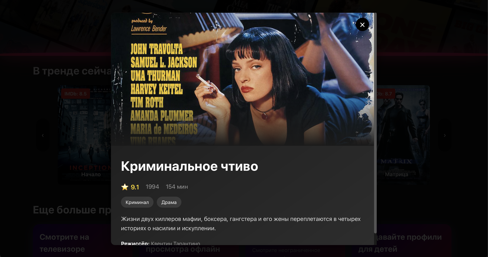
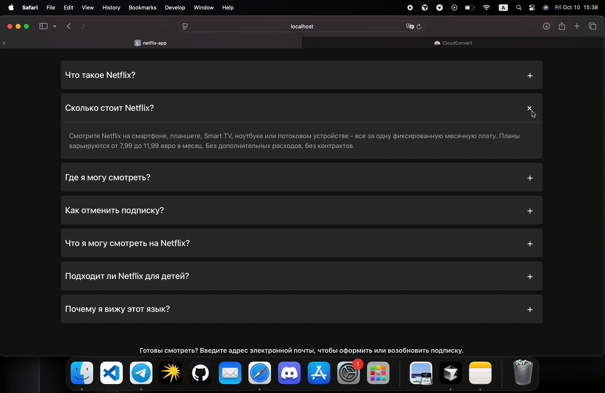
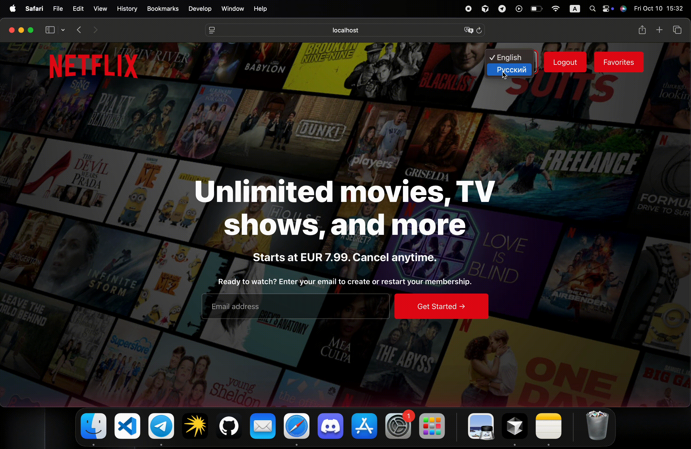

# 🎬 Netflix Clone

Полнофункциональное веб-приложение Netflix с авторизацией, избранным и мультиязычностью.

## 📸 Скриншоты

> *Скриншоты будут добавлены*

### Главная страница


### Слайдер с фильмами


### Модальное окно фильма


### Страница входа


### Страница регистрации


### Страница избранного


### FAQ секция


### Переключение языков


---

## 🚀 Технологии

**Frontend:**
- React 19 + Vite
- React Router DOM v7
- Redux Toolkit + React Redux
- i18next + react-i18next
- CSS Modules

**Backend & Database:**
- Firebase Authentication
- Firebase Firestore
- Real-time синхронизация

**Дополнительно:**
- react-icons
- i18next-browser-languagedetector
- i18next-http-backend

## ✨ Основные возможности

### 🔐 Авторизация (Firebase Auth)
- Регистрация с email/password
- Вход с валидацией
- Персистентная сессия (автоматическая проверка при загрузке)
- Logout с очисткой состояния
- Обработка ошибок на русском/английском

### ❤️ Избранное (Firestore)
- Сохранение в облаке для каждого пользователя
- Real-time синхронизация через `onSnapshot`
- Страница `/favorites` с отображением избранных фильмов
- Работает только для авторизованных пользователей

### 🎭 Модальные окна
- Детальная информация о фильме
- Перевод жанров, режиссёров, длительности
- Закрытие по клику вне окна, Escape или кнопке ×
- Блокировка прокрутки страницы при открытии

### 🌍 Мультиязычность (i18next)
- Английский (EN) и Русский (RU)
- Автоопределение языка браузера
- Сохранение выбора в localStorage
- Динамическая загрузка переводов из JSON

### 📱 Адаптивный дизайн
- Mobile-first подход
- Flexbox/Grid верстка
- Адаптивные карточки фильмов
- Оптимизация для всех устройств

## 📂 Структура проекта

```
src/
├── pages/              # Страницы приложения
│   ├── HomePage/       # Главная страница
│   ├── LoginPage/      # Страница входа
│   ├── RegisterPage/   # Страница регистрации
│   ├── FavoritePage/   # Страница избранного
│   └── index.js        # Barrel экспорт
│
├── Components/         # React компоненты
│   ├── AuthProvider/   # Проверка Firebase сессии
│   ├── AuthForm/       # Общая форма для login/register
│   ├── Header/         # Навигация и hero-секция
│   ├── Modal/          # Универсальное модальное окно
│   ├── MovieDetailsModal/  # Детали фильма
│   ├── MovieSlider/    # Слайдер с фильмами
│   ├── MovieCard/      # Карточка фильма
│   ├── FavoriteButton/ # Кнопка избранного (Firestore)
│   ├── Favorites/      # Список избранных фильмов
│   ├── FAQGroup/       # Группа FAQ
│   ├── FAQElement/     # Элемент FAQ
│   ├── ReasonsCardSet/ # Набор карточек "Причины"
│   ├── ReasonsCard/    # Карточка с преимуществом
│   ├── MembershipForm/ # Форма подписки
│   ├── PasswordInput/  # Инпут пароля с show/hide
│   ├── Loader/         # Спиннер загрузки
│   ├── HeartIcon/      # SVG иконка сердечка
│   ├── Title/          # Компонент заголовка
│   └── Footer/         # Подвал сайта
│
├── data/               # Централизованные данные
│   ├── movies.js       # 10 фильмов с деталями
│   ├── reasons.js      # Причины присоединиться
│   └── faqs.js         # FAQ вопросы
│
├── store/              # Redux Store
│   ├── index.js        # Конфигурация store
│   └── slices/
│       └── userSlice.js  # User state (email, id, token)
│
├── hooks/              # Custom hooks
│   ├── use-auth.jsx    # Доступ к данным пользователя
│   └── useModal.jsx    # Управление модальными окнами
│
├── utils/              # Утилиты
│   └── favorites.js    # Работа с Firestore избранным
│
├── config/
│   └── i18n.js         # Конфигурация i18next
│
├── styles/             # Глобальные стили
│   ├── index.css
│   ├── globals.css
│   └── variables.css
│
├── firebase.js         # Конфигурация Firebase
├── App.jsx             # Роутинг с AuthProvider
└── main.jsx            # Точка входа (Redux + Router + i18n)

public/
└── locales/            # Переводы
    ├── en/translation.json
    └── ru/translation.json
```

## 🛣️ Маршруты

| Путь | Описание |
|------|----------|
| `/` | Главная страница (Header + MovieSlider + Reasons + FAQ + Footer) |
| `/login` | Страница входа |
| `/register` | Страница регистрации |
| `/register?email=...` | Регистрация с предзаполненным email |
| `/favorites` | Страница избранных фильмов (требует авторизации) |

## 🎨 Архитектура

### State Management
- **Redux Toolkit** - глобальное состояние пользователя (email, id, token)
- **useState** - локальное состояние компонентов
- **useEffect** - Firebase listeners, загрузка данных
- **useMemo** - мемоизация Firestore references

### Firebase Integration
```javascript
// AuthProvider - проверка сессии при загрузке
onAuthStateChanged(auth, (user) => {
  if (user) dispatch(setUser(...))
  else dispatch(removeUser())
})

// FavoriteButton - real-time синхронизация
onSnapshot(favoriteDocRef, (docSnapshot) => {
  setIsFavorite(docSnapshot.exists())
})

// Firestore структура
users/{userId}/favorites/{movieId}
  - movieId: string
  - addedAt: ISO string
```

### Custom Hooks
- **useAuth()** - доступ к `{ email, id, token, isAuth }` из Redux
- **useModal()** - управление модальными окнами `{ isOpen, openModal, closeModal, modalContent }`

### i18n Pattern
```javascript
// Централизованные данные с ключами переводов
{ 
  titleKey: 'movies.inception',
  genreKeys: ['genres.action', 'genres.sciFi'],
  descriptionKey: 'movies.inception.description'
}

// Рендеринг с переводом
<h2>{t(movie.titleKey)}</h2>
{movie.genreKeys.map(key => <span>{t(key)}</span>)}
```

### CSS Modules
- Изолированные стили для каждого компонента
- CSS Variables в `variables.css` для цветов
- Адаптивность через media queries

## 📦 Установка и запуск

### 1. Установка зависимостей
```bash
npm install
```

### 2. Настройка Firebase

Создайте проект на [Firebase Console](https://console.firebase.google.com/)

**Включите сервисы:**
- Authentication → Email/Password
- Firestore Database

**Создайте `.env` в корне проекта:**
```env
VITE_FIREBASE_API_KEY=your_api_key
VITE_FIREBASE_AUTH_DOMAIN=your_auth_domain
VITE_FIREBASE_PROJECT_ID=your_project_id
VITE_FIREBASE_STORAGE_BUCKET=your_storage_bucket
VITE_FIREBASE_MESSAGING_SENDER_ID=your_sender_id
VITE_FIREBASE_APP_ID=your_app_id
```

**Настройте Firestore Rules:**
```javascript
rules_version = '2';
service cloud.firestore {
  match /databases/{database}/documents {
    match /users/{userId}/favorites/{movieId} {
      allow read, write: if request.auth != null && request.auth.uid == userId;
    }
  }
}
```

### 3. Запуск
```bash
# Разработка
npm run dev

# Продакшн сборка
npm run build

# Превью сборки
npm run preview
```

## 🎯 Ключевые компоненты

### AuthProvider
Оборачивает приложение, проверяет Firebase сессию при загрузке, показывает Loader до завершения проверки.

### FavoriteButton
- Real-time синхронизация через `onSnapshot`
- Добавление/удаление через `setDoc/deleteDoc`
- Мемоизация Firestore reference через `useMemo`
- Disabled для неавторизованных

### MovieDetailsModal
- Открывается по клику на фильм
- Переводит жанры, режиссёров, длительность
- Закрывается по Escape, клику вне окна или ×
- Блокирует прокрутку страницы

### Favorites Page
- Загружает избранное через `getUserFavorites(userId)`
- Фильтрует `MOVIES_DATA` по избранным ID
- Показывает Loader во время загрузки
- Отображает сообщения для незалогиненных/пустого списка

## 🎬 Каталог фильмов

| ID | Фильм | Год | Жанры |
|----|-------|-----|-------|
| 1 | The Truman Show | 1998 | Drama, Comedy, Sci-Fi |
| 2 | Inception | 2010 | Action, Sci-Fi, Thriller |
| 3 | The Dark Knight | 2008 | Action, Crime, Drama |
| 4 | Interstellar | 2014 | Adventure, Drama, Sci-Fi |
| 5 | Pulp Fiction | 1994 | Crime, Drama |
| 6 | The Matrix | 1999 | Action, Sci-Fi |
| 7 | Forrest Gump | 1994 | Drama, Romance |
| 8 | The Shawshank Redemption | 1994 | Drama |
| 9 | Goodfellas | 1990 | Biography, Crime, Drama |
| 10 | The Godfather | 1972 | Crime, Drama |

## 🌍 Добавление нового языка

1. Создайте папку `public/locales/{lang_code}/`
2. Добавьте `translation.json` с переводами
3. Обновите `Header.jsx`:
```javascript
const languages = [
  { code: "en", name: "English" },
  { code: "ru", name: "Русский" },
  { code: "es", name: "Español" } // новый язык
];
```

## 🚀 Деплой

Проект готов к деплою на Vercel, Netlify, GitHub Pages.

**Важно:** Добавьте environment variables в настройках хостинга:
- `VITE_FIREBASE_API_KEY`
- `VITE_FIREBASE_AUTH_DOMAIN`
- и т.д.

```bash
npm run build
# dist/ готов к деплою
```

---

**Стек:** React 19 • Vite • Firebase • Redux Toolkit • i18next  
